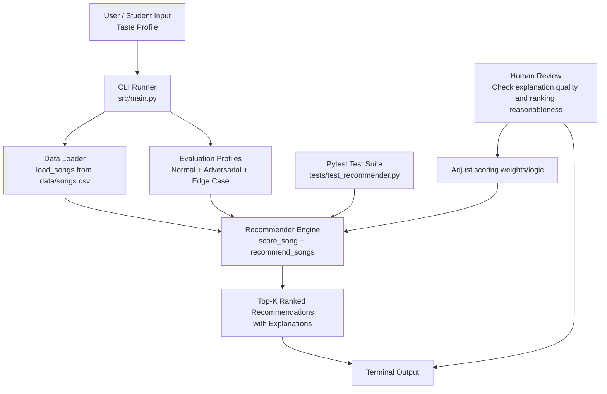

# Music Recommender Simulation

## Project Summary

This project is a lightweight AI music recommender that ranks songs based on a user taste profile. It loads songs from a CSV dataset, scores each song with transparent rules, returns top recommendations, and explains why each recommendation was chosen.

The system is designed to be reproducible, testable, and safe to run in classroom settings.

## Assignment Feature Implemented: Reliability and Testing System

This project includes a reliability/testing feature integrated into the core app behavior:

- The main runner evaluates multiple user profiles, including adversarial and edge-case profiles.
- The recommender generates per-song explanations to make score behavior auditable.
- Unit tests validate expected ranking and explanation behavior.
- Input guardrails clamp out-of-range numeric values and log warnings.

This feature is part of the main recommendation flow, not a separate script.

## How the System Works

For each song, the recommender computes a score using:

- Genre match bonus
- Mood match bonus
- Energy similarity reward
- Acoustic preference alignment bonus

Songs are sorted by final score and the top-k are returned.

### Data Inputs

Song features:

- id
- title
- artist
- genre
- mood
- energy
- tempo_bpm
- valence
- danceability
- acousticness

User profile features:

- favorite_genre
- favorite_mood
- target_energy
- likes_acoustic

## Guardrails and Logging

The system includes runtime safeguards:

- Numeric values expected in [0, 1] are clamped if out of range.
- Missing or malformed numeric values fall back to safe defaults.
- Startup exits with a clear error if the CSV file is missing or empty.
- Logging is enabled in the CLI runner for startup, warnings, and failure paths.

## Project Structure

- src/: recommender logic and CLI entry point
- data/: CSV dataset
- tests/: automated tests
- assets/: screenshots and architecture images

## Setup

1. Create and activate a virtual environment.

```bash
python3 -m venv .venv
source .venv/bin/activate
```

2. Install dependencies.

```bash
pip install -r requirements.txt
```

## Run the App

```bash
python -m src.main
```

## Run Tests

```bash
PYTHONPATH=. pytest -q
```

## Design and Architecture

This diagram shows the main system components, data flow, and where human/testing feedback validates AI behavior.



Key checks in this architecture:

- Automated testing: Pytest verifies recommendation and explanation behavior.
- Human-in-the-loop review: The user inspects outputs and explanations for quality.
- Reliability loops: Adversarial and edge-case profiles stress-test behavior.

## Screenshots

Store all project visuals in assets/.

- High-Energy Pop: 
- Chill Lofi: 
- Deep Intense Rock: 
- Adversarial Conflict: 
- Edge Case Profile: 

If you use Mermaid diagrams, generate them in Mermaid Live Editor and export PNG files into assets/.

## Limitations and Risks

- The dataset is small and synthetic, so recommendations are not production-grade.
- Rule-based scoring may over-prioritize selected features and under-represent nuance.
- User preference inputs are simple and do not capture evolving taste.

## Reflection and Documentation

- Model card: model_card.md
- Reflection: reflection.md
